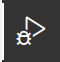

# ATAD | Depuração com GDB

Este documento assume que tem todos os pacotes de software necessários instalados. Consulte as notas de instalação caso não tenha a certeza (noutro ficheiro).

---

A depuração pode ser realizada de duas formas:

1. Dentro do VS Code (o processo será anexado ao `gdb` com interação via interface gráfica).

   * Este método requer alguma configuração manual, mas se tiver *clonado* o projeto `CProgram_Template`, pode ignorar a secção "Apêndice | Configuração manual do projeto no VS Code". Irá funcionar "diretamente".

2. Diretamente no terminal, utilizando o comando `gdb`.

## Programa de exemplo

Considere o seguinte programa em `main.c`. A linha 9 está identificada; iremos definir um *breakpoint* aqui mais tarde.

```cpp
#include <stdio.h> 
#include <stdlib.h>
#include <string.h>

int main() {

    char str[30] = "Debugging in VS Code";

    int i = 0; // <--- Linha 9
    while(str[i] != '\0') {
        printf("%c\n", str[i]);

        i++;
    }
    printf("Done!");

    return EXIT_SUCCESS;
}
```

## Compilar com símbolos de depuração

Para tornar a depuração possível, o seu programa deve ser compilado com *símbolos de depuração*, usando a flag `-g`.

> Independentemente do método de depuração, assumiremos que existe um *makefile* usado para compilar o programa.

O seu `makefile` deve ser semelhante a este (a parte importante é a utilização da flag `-g`; esta inclui os símbolos de depuração no executável):

```console
default:
    gcc -Wall -o prog main.c
debug:
    gcc -Wall -o prog -g main.c
clean:
    rm -f prog
```

Note que o ficheiro executável em todos os casos se chama `prog`.

Compile o programa usando o comando `make` e invocando a diretiva `debug`:

```console
$> make debug
```

## 1. Depuração no VS Code

Este método assume que tem um *makefile* no seu projeto com uma diretiva chamada `debug` e também uma pasta `.vscode` com o conteúdo descrito em "Apêndice | Configuração manual do projeto no VS Code". Se estiver a usar o projeto base `CProgram_Template`, a pasta e o makefile já existem.

1. No programa anterior, coloque um *breakpoint* na linha `9` (clique com o rato ao lado do número da linha). Deverá ver um círculo vermelho persistente, indicando que, durante a depuração, o programa irá parar aqui e terá controlo do fluxo de execução.

2. Abra o separador **Run and Debug** (lado esquerdo, veja imagem abaixo):

   

3. Clique no ícone verde de *play* no topo, ao lado de "gdb - Debug project". A depuração irá começar.

   * Isto chamará automaticamente `make debug` e executará o `gdb` sobre o executável `prog`.

4. No painel **Variables** poderá ver os valores atuais de `str` (todas as posições do array) e `i`. A variável `i` ainda não está inicializada, porque a instrução na linha 9 ainda não foi executada.

5. Adicione a expressão "`str[i]`" à lista **Watch**, antes de continuar;

6. Use o comando **Step Over (F10)** para avançar linha a linha, observando os valores mudarem durante a execução do programa.

## 2. Depuração no Terminal

O `gdb` possui um modo gráfico chamado TUI, que permite visualizar a instrução atual durante a depuração.

1. Compile o programa com símbolos de depuração, por exemplo:

   ```console
   $> make debug
   ```

2. Execute o `gdb` com o programa como entrada:

   ```console
   $> gdb ./prog
   ```

   Aceite (ENTER) todas as perguntas até chegar ao prompt `(gdb)`.

3. Ative o visualizador gráfico do código-fonte (TUI):

   ```gdb
   (gdb) layout src
   ```

   Isto mostrará o código-fonte. Se ficar "confuso", use o atalho Control+L para atualizar.

4. Defina o *breakpoint*:

   ```gdb
   (gdb) break main.c:9
   ```

   A sintaxe é `<ficheiro>.c:<número_da_linha>`. Se o projeto tiver vários ficheiros, pode colocar breakpoints em qualquer um deles. É possível definir vários breakpoints.

5. Inicie a execução do programa:

   ```gdb
   (gdb) run
   ```

   O programa irá parar no primeiro breakpoint.

6. Em qualquer momento, pode imprimir o valor atual de uma variável, por exemplo:

   ```gdb
   (gdb) print str
   (gdb) print i
   ```

7. Para "observar" uma variável, use:

   ```gdb
   (gdb) watch i
   ```

   Sempre que `i` mudar, será notificado.

8. Para executar o programa passo a passo, use `step` (ou `s`) ou `next` (ou `n`), por exemplo:

   ```gdb
   (gdb) next
   ```

9. Se apenas pressionar ENTER, o comando anterior será repetido (neste caso, `next`).

10. Para terminar o processo de depuração, pressione Control+C e depois saia do `gdb`:

    ```gdb
    (gdb) quit
    ```

**Mais informações em**:

* [https://www.cs.umd.edu/~srhuang/teaching/cmsc212/gdb-tutorial-handout.pdf](https://www.cs.umd.edu/~srhuang/teaching/cmsc212/gdb-tutorial-handout.pdf)
* [https://www.youtube.com/watch?v=MTkDTjdDP3c](https://www.youtube.com/watch?v=MTkDTjdDP3c)

## Apêndice | Configuração manual do projeto no VS Code

Siga os seguintes passos para garantir o correto uso do *gdb* dentro do *VS Code*, com todas as funcionalidades interativas:

1. Crie uma pasta chamada `.vscode` no seu diretório de trabalho.

2. Crie e copie o conteúdo dos seguintes ficheiros:

`tasks.json`

```json
{
    "tasks": [
        {
            "type": "cppbuild",
            "label": "C/C++: call make debug",
            "command": "/usr/bin/make",
            "args": [
                "debug"
            ],
            "options": {
                "cwd": "${workspaceFolder}"
            },
            "problemMatcher": [
                "$gcc"
            ],
            "group": {
                "kind": "build",
                "isDefault": true
            },
            "detail": "Task generated by Debugger."
        }
    ],
    "version": "2.0.0"
}
```

`launch.json`

```json
{    
    "version": "0.2.0",
    "configurations": [
        {
            "name": "gdb - Debug project",
            "type": "cppdbg",
            "request": "launch",
            "program": "${workspaceFolder}/prog",
            "args": [],
            "stopAtEntry": false,
            "cwd": "${workspaceFolder}",
            "environment": [],
            "MIMode": "gdb",
            "setupCommands": [
                {
                    "description": "Enable pretty-printing for gdb",
                    "text": "-enable-pretty-printing",
                    "ignoreFailures": true
                }
            ],
            "preLaunchTask": "C/C++: call make debug",
            "miDebuggerPath": "/usr/bin/gdb"
        }
    ]
}
```

## Autor e suporte

Bruno Silva ([bruno.silva@estsetubal.ips.pt](mailto:bruno.silva@estsetubal.ips.pt))

Deverá contactar o seu docente de PL para qualquer apoio relativamente a estes conteúdos e procedimentos.
