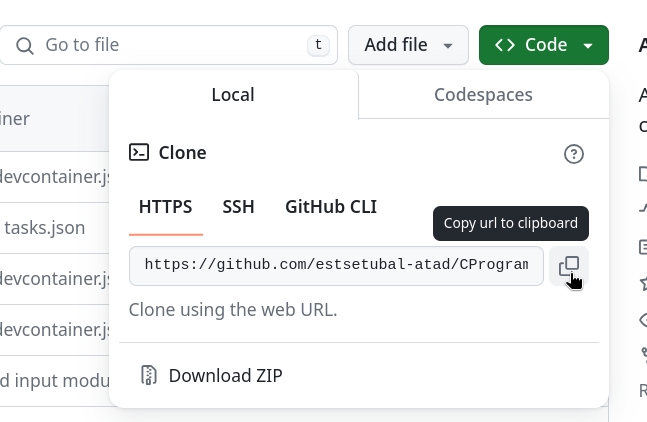

# ATAD | Ambiente de Desenvolvimento

> **Nota**: Este documento assume que já obteve o software necessário, seja através de instalação manual ou de *docker container*.

Ao longo da unidade curricular será necessário executar `git clone` de repositórios *template*. Estes contêm, no mínimo, uma estrutura de projeto adequada ao desenvolvimento de programas em C no VS Code; alguns incluem também código inicial adicional.

Este documento descreve os passos necessários — com os quais deverá estar confortável — para clonar um repositório, programar, compilar e executar um programa:

1. Clonar um repositório e abrir o projeto no VS Code;

2. Instalar extensões do VS Code (apenas na primeira utilização);

3. Programar, compilar e executar o programa.

> **Tutorial no YouTube**: [https://www.youtube.com/watch?v=THsizwp30r0](https://www.youtube.com/watch?v=THsizwp30r0)
>
> Os passos descritos neste documento estão ilustrados nesse vídeo.

---

## 1 | Clonar um repositório e abrir o projeto no VS Code

Antes de começar, recomenda-se a criação de uma pasta principal no seu sistema de ficheiros para centralizar todos os futuros projetos de ATAD.

De seguida, siga as instruções correspondentes ao método de instalação que utilizou.

> [!TIP]
> Poderá optar por descarregar o zip em vez de *clonar* um repositório. Esta opção está ilustrada no [tutorial do YouTube](https://www.youtube.com/watch?v=THsizwp30r0).
> 
---

### 1.1 | Windows/WSL ou Linux

1. No Explorador de Ficheiros, navegue até à pasta principal criada e faça *Shift + Clique Direito* dentro da mesma. No menu de contexto deverá surgir uma opção semelhante a **Open Linux Shell here**; selecione-a para abrir o terminal Ubuntu nessa pasta.

   * Se estiver a utilizar Linux, use a ação equivalente **Open Terminal** para abrir um terminal nessa localização.

2. No terminal, clone, por exemplo, o repositório `CProgram_Template`:

   ```console
   $> git clone https://github.com/estsetubal-atad/CProgram_Template.git MyCProgram
   ```

   * Altere o URL conforme o *template* pretendido;

   * O último argumento (opcional) corresponde ao nome da pasta que será criada com o conteúdo do repositório. Se não o indicar, a pasta criada terá o mesmo nome do repositório, por exemplo "CProgram_Template".

3. A partir do mesmo terminal, abra o projeto com o *VS Code*:

   ```console
   $> code MyCProgram/
   ```

   * **Nota:** quando surgir a mensagem a perguntar se pretende "reopen folder to develop in a container", selecione **"Don't Show Again"**.

---

### 1.2 | Docker container

Se estiver a utilizar a metodologia baseada em *docker container*, assumimos que está em Windows ou MacOS.

Em qualquer dos casos, deverá ter instalado a aplicação `git`, conforme descrito no documento [Software](Software.md).

1. Para clonar um repositório, siga os passos 1-3 da secção anterior, mas a partir de um terminal PowerShell (Windows) ou Terminal (MacOS).

2. Quando surgir a mensagem a perguntar se pretende "reopen folder to develop in a container", selecione **"Reopen in container"**.

---

## 2 | Instalar extensões do VS Code

Instale as seguintes extensões a partir do VS Code Marketplace (utilize o **ID** da extensão para a procurar):

* Name: **C/C++**
  ID: ms-vscode.cpptools  
  Description: C/C++ IntelliSense, debugging, and code browsing.  
  Publisher: Microsoft  

* Name: **Doxygen Documentation Generator**
  ID: cschlosser.doxdocgen  
  Description: Let me generate Doxygen documentation from your source code for you.  
  Publisher: Christoph Schlosser  

> [!TIP]
> Este procedimento instala as extensões no contexto do seu ambiente WSL ou *docker*. Não será necessário repetir este passo posteriormente. As extensões serão atualizadas automaticamente quando necessário.

---

## 3 | Programar, compilar e executar o programa

Utilize o IDE para criar novos ficheiros (por exemplo, módulos) e desenvolver o seu código.

Para compilar e executar o programa, abra o *terminal integrado*: Menu **Terminal > New Terminal**.

Execute o `makefile`:

```console
$> make
```

e depois execute o programa:

```console
$> ./prog
```

---

## Apêndice – Dicas e truques

### URLs dos repositórios

O URL necessário para o procedimento de *clone* pode ser obtido na página do repositório no GitHub, conforme ilustrado na imagem seguinte:



Ao clicar no botão, o URL será *copiado* para a área de transferência. Poderá depois *colar* esse URL com Control+V, ou Control+Shift+V num terminal Linux/WSL.

---

### Ligações remotas

Verifique sempre, no canto inferior esquerdo (barra verde) do VS Code, que está a abrir os seus projetos através de uma ligação remota, seja para WSL ou para um container.
