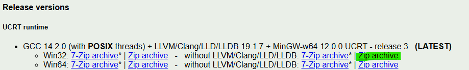

# ATAD | Software, Métodos Alternativos

Estas opções devem ser utilizadas caso tenha esgotado os métodos descritos no documento [Software](Software.md).

São apresentadas por ordem de preferência:

1. Máquina Virtual (funciona em qualquer sistema operativo), ou;

2. VS Code e MinGW (apenas para computadores da escola com Windows).

---

## 1 | Máquina Virtual

A utilização de uma máquina virtual permitirá ter um sistema operativo Linux virtualizado (*guest*) a correr sobre o seu sistema operativo principal (*host*).

Esta solução pode exigir mais recursos do que os métodos anteriormente descritos.

1. Siga as instruções disponíveis [aqui](https://ubuntu.com/tutorials/how-to-run-ubuntu-desktop-on-a-virtual-machine-using-virtualbox#1-overview).

2. Siga as instruções do documento [Software](Software.md), a partir do passo `6` de "Manual installation (Windows/WSL or Linux)".

> A funcionalidade **Shared Folders** é fortemente recomendada, pois permite manter todos os seus projetos no sistema de ficheiros do sistema operativo principal (*host*).

---

## 2 | MinGW + Extensão VS Code

<u>Esta é a última opção</u> e ficará com uma *toolchain* incompleta. Em particular, **não terá**:

* *Valgrind* (verificação de memória dinâmica);
* Possivelmente, *Doxygen* (documentação), dependendo da instalação do MinGW.

No entanto, **esta será a opção utilizada nos computadores da escola para realizar os trabalhos**, caso não disponha de computador portátil pessoal.

> [!TIP]
> Os computadores da escola deverão ter o MinGW instalado; verifique a existência de uma pasta MinGW (`C:\MinGW` ou `C:\mingw32`). Se existir, poderá utilizar essa instalação.

---

### Extensão MinGW para VS Code

Para utilizar corretamente o MinGW, deverá instalar a extensão do VS Code [MinGW C Configuration](https://marketplace.visualstudio.com/items?itemName=brunomnsilva.mingw-c-configuration):

> Name: **MinGW C Configuration**
> ID: brunomnsilva.mingw-c-configuration
> Publisher: Bruno Silva

Em cada projeto aberto, execute o comando disponibilizado pela extensão para configurar o projeto no VS Code. **Siga as instruções na página da extensão**.

---

### 💡 Instalação do MinGW numa Pen USB

A instalação do MinGW pode também ser colocada numa pen USB pessoal, permitindo realizar todo o desenvolvimento a partir dessa unidade. Trata-se de uma solução portátil para qualquer computador Windows.

**Ligações úteis**:

* WinLibs standalone build of GCC: [Link](https://winlibs.com/#download-release)

Execute os seguintes passos, onde `<DRIVE>` corresponde à unidade de instalação, por exemplo `D:` (pen USB):

1. Aceda à ligação *WinLibs* acima.

   Procure o ficheiro *zip* mais recente **Win32 - without LLVM/Clang/LLD/LLDB**, por exemplo:

   

   Guarde-o no seu computador.

2. Extraia a pasta `mingw32` do ficheiro *zip* para `<DRIVE>:\`, ou seja, deverá ficar com uma pasta de instalação como `D:\mingw32\`.

3. Concluído. A partir deste momento é importante utilizar a *extensão* referida acima, que irá injetar as configurações necessárias para localizar os *binaries* desta instalação.

---

## Autor e apoio

Bruno Silva ([bruno.silva@estsetubal.ips.pt](mailto:bruno.silva@estsetubal.ips.pt))

Para qualquer dúvida relacionada com estes conteúdos e procedimentos, deverá contactar o seu docente de PL.
